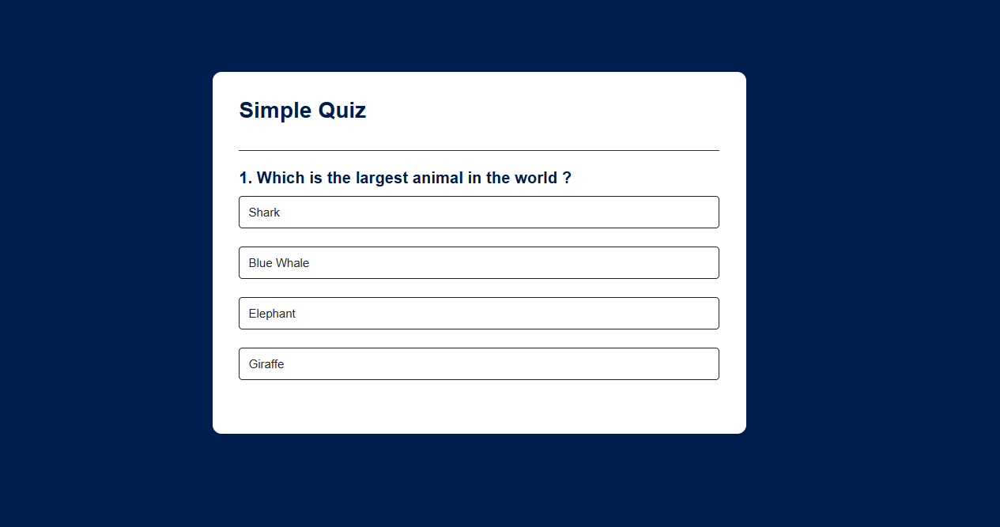
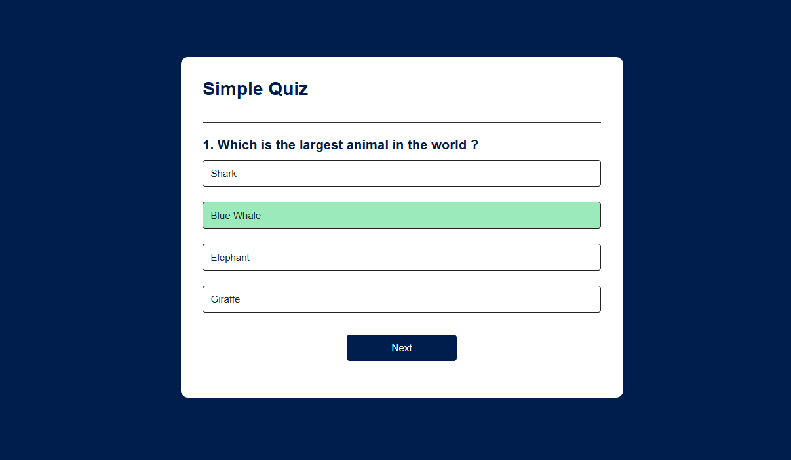
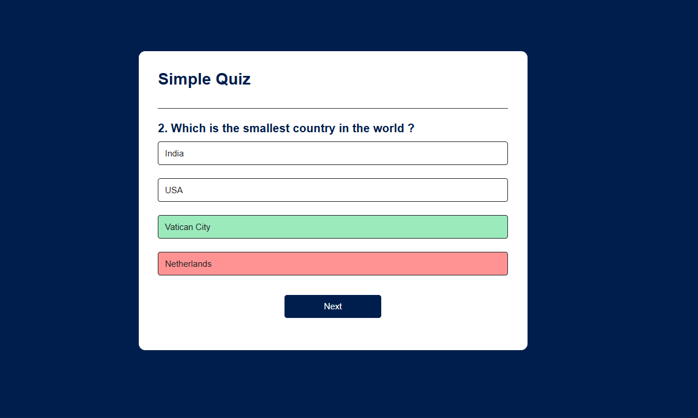

# 🧠 Simple Quiz App

A clean, minimalist, and fully interactive **Quiz Application** built using vanilla JavaScript, HTML5, and CSS3. The application dynamically handles general knowledge questions, tracks user scores, provides real-time color feedback upon selection, and blocks multi-click inputs to ensure quiz integrity.

---

## 🚀 Live Demo

Check out the live project here: **[Live Demo Link](https://your-username.github.io/your-repo-name/)** *(Update this link after deploying on GitHub Pages, Vercel, or Netlify)*

---

## 📸 Screenshots

Here is a look at the quiz states in action:

### 1. Default Question State
The quiz loads dynamic questions with clean, accessible option buttons. The "Next" navigation remains hidden until an option is picked.


---

### 2. Correct Answer Feedback
Selecting the correct option immediately highlights it in light green (`#9aeabc`) and reveals the navigation button.


---

### 3. Incorrect Answer Feedback
Selecting an incorrect option highlights it in soft red (`#ff9393`), while simultaneously highlighting the true correct answer in green so the user always learns the right choice.


---

## ✨ Features

* **Dynamic DOM Population:** Questions and their nested answers are injected into the DOM on-the-fly from a JavaScript array of objects.
* **Smart UI Feedback Loops:**
  * **Correct Choice:** Transitions the selected button to green.
  * **Incorrect Choice:** Pinpoints the user's error in red while auto-revealing the correct choice in green.
* **Input Lockout State:** Once an option is clicked, all answer buttons instantly toggle to a `disabled` state with a custom `no-drop` cursor to block sneaky multiple submissions.
* **Conditional Workflow:** The "Next" button only renders to the screen after a selection is logged, guiding the user organically through the assessment.
* **Dynamic Reset Engine:** Triggers a seamless "Play Again" cycle that resets the internal indexes, score trackers, and removes disabled attributes without reloading the browser window.

---

## 🛠️ Tech Stack

* **HTML5:** Provides semantic structural layout buckets (`.app`, `.quiz`, `#answer-button`).
* **CSS3:** Governs the dark blue aesthetic (`#001e4d`), card formatting, Poppins type scale, hover animations, and transactional status modifiers (`.correct` / `.incorrect`).
* **JavaScript (ES6):** Manages the logical state architecture, event routing, array parsing via `.forEach()`, and dataset evaluation.

---

## 📂 Project Structure

```text
├── index.html            # Core structural wrapper 
├── style.css             # Interface layout, palettes, and active states
├── app.js                # Core state logic and question database
├── quiz-home.png         # State screenshot (Home View)
├── correct-answer.png    # State screenshot (Correct Answer View)
└── incorrect-answer.png  # State screenshot (Incorrect Answer View)
